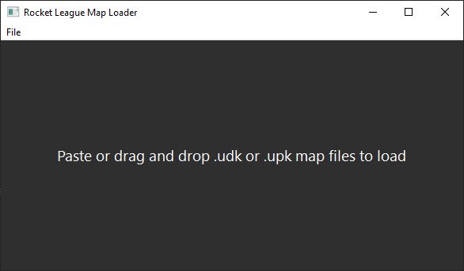

# RL Map Loader

Most simple custom map loader. The mods directory is found automatically

Load a custom map into Rocket League with drag and drop or by pasting files from the clipboard

## How do I play the map after loading?

1. Make sure the BakkesMod program is running
2. Make sure you have the [Rocket Plugin](https://bakkesplugins.com/plugins/view/26) plugin installed
3. Launch Rocket League. Press F2 in-game to bring up the BakkesMod menu. If this does not come up, BakkesMod was unable to inject into your game and you should [troubleshoot](https://bakkesmod.fandom.com/wiki/Troubleshooting)
4. Go to Plugins->Rocket Plugin->Open Rocket Plugin GUI
5. Check the box to enable custom maps
6. Choose the custom map you loaded in by its filename

Note: You do not have to rename the custom map to an existing map like Labs_Underpass_P.upk anymore. You can simply choose the map from the GUI as specified above.

## Behind the scenes

Finds Rocket League automatically by parsing `libraryfolders.vdf`. Creates a "mods" folder in CookedPCConsole and copies the map there. It will overwrite a custom map with the same filename.
